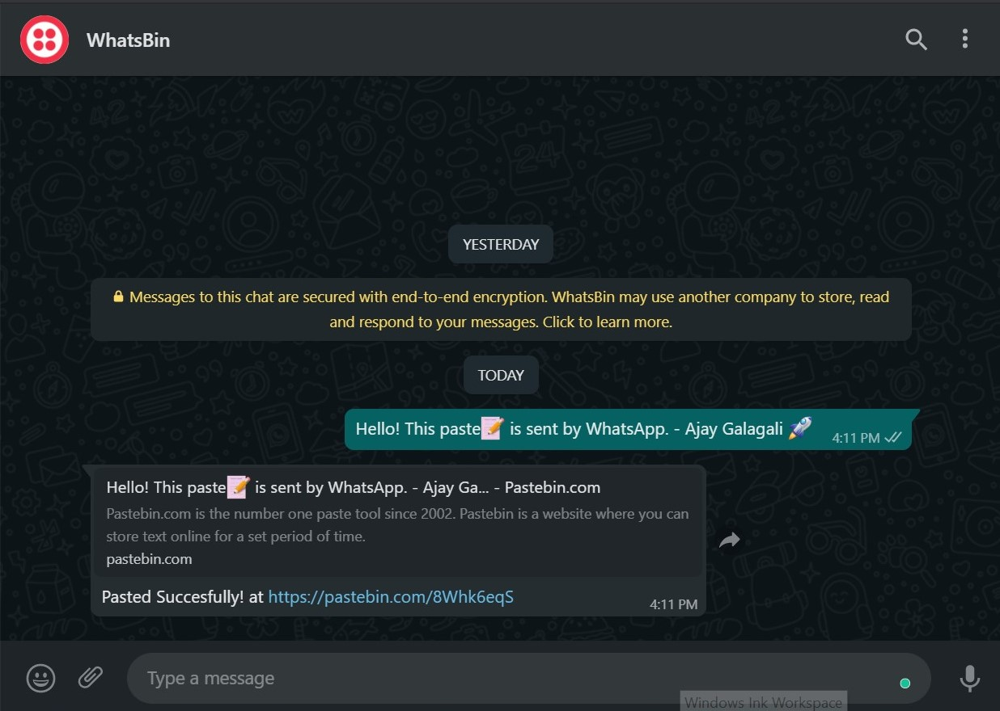
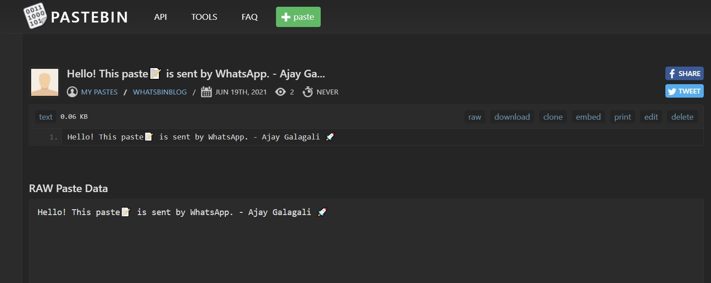

## WhatsBin - Integration of WhatsApp and Pastebin

#### Problem Statement

[WhatsApp][whatsapp] Web doesn't load and keeps retrying on poor internet connection, thus, making it difficult to transfer text/links recived in WhatsApp smartphone app to desktop.

#### Solution

Just forward/type the message to a specific contact which automatically reflects your message in your account of [pastebin.com][pastebin]. From there you can access your message in desktop.

#### Objective

Pasting on [pastebin.com][pastebin] by sending messages in WhatsApp without visiting to [pastebin.com][pastebin].

#### Results

  
  

#### Tools

- [Twilio WhatsApp Sandbox][twiliowhatsappsandbox]
- [Netlify Functions][netlifyfunctions]
- [Pastebin API][pastebinapi]

#### Want to know implementation?

Check out my blog [here][blog] ✍

🛠 Developed by [Ajay Galagali][me]

[pastebin]: https://pastebin.com/
[netlifyfunctions]: https://www.netlify.com/products/functions/
[pastebinapi]: https://pastebin.com/doc_api
[twiliowhatsappsandbox]: https://www.twilio.com/docs/whatsapp/sandbox
[whatsapp]: https://www.whatsapp.com/?lang=en
[me]: https://linktr.ee/ajaygalagali
[blog]: https://ajaygalagali.hashnode.dev/how-to-paste-on-pastebin-using-whatsapp
